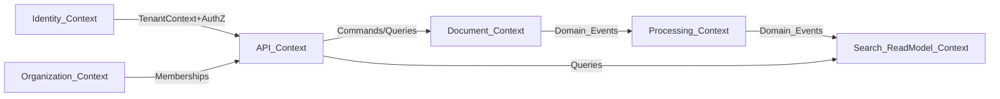
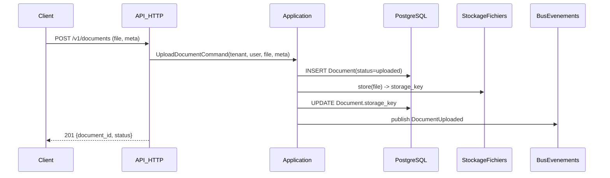
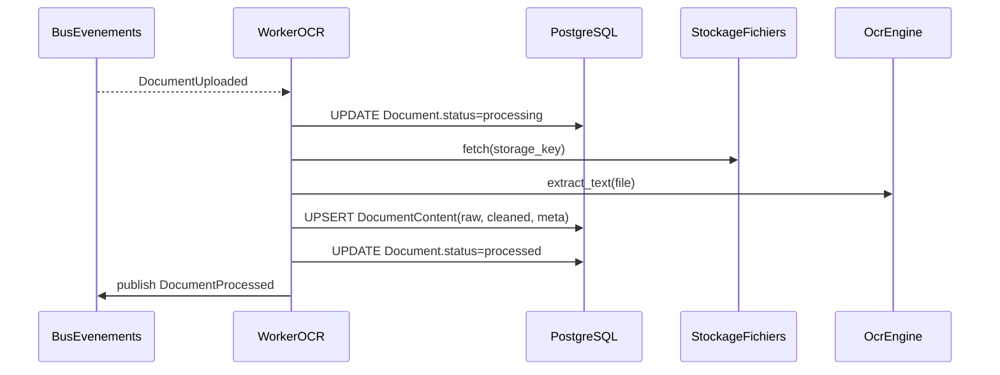
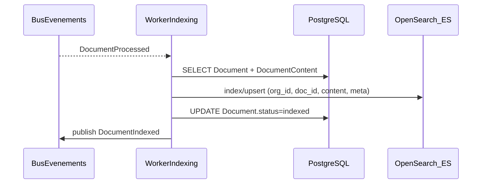
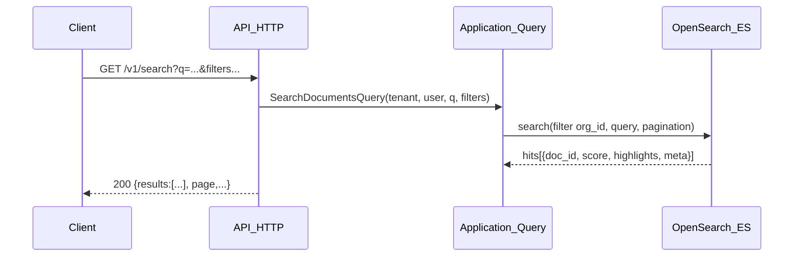
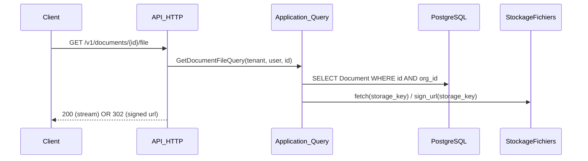
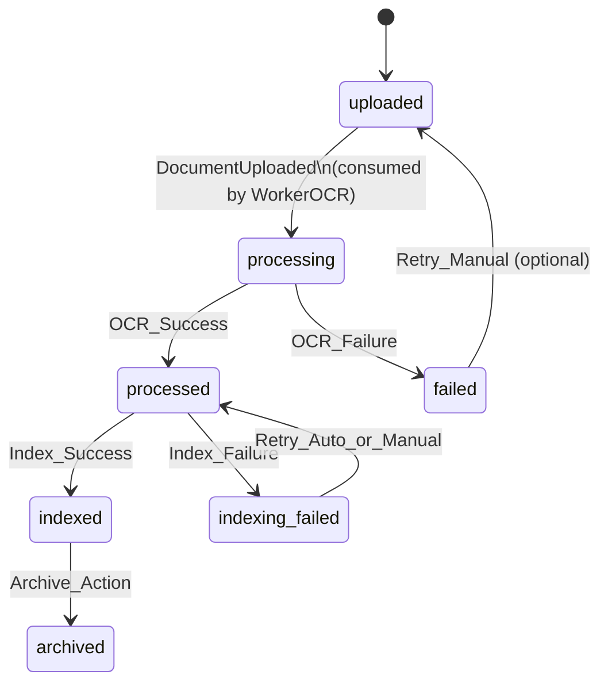
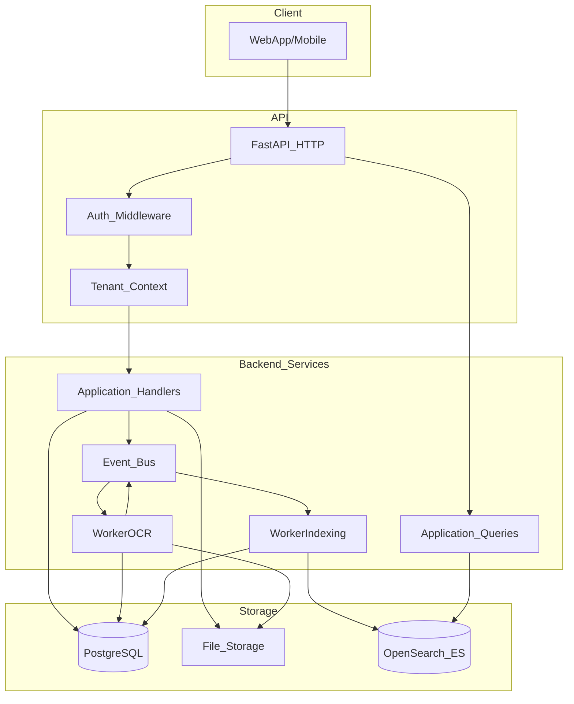
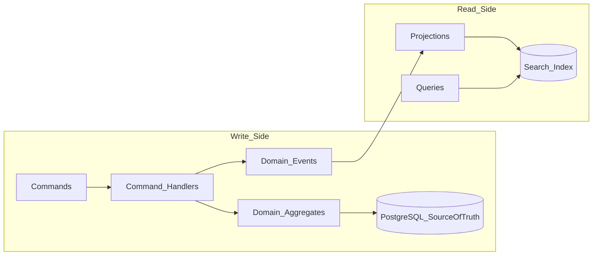

# 📚 CleverDocs — Plateforme de recherche documentaire intelligente (DDD / CQRS / Multi-tenant)

## 🎯 Vision
**CleverDocs** est une plateforme **multi-tenant** qui transforme des documents (PDF/images/scans) en **contenu recherchable** et renvoie **les documents pertinents** à partir d’une requête, grâce à un pipeline **asynchrone** (OCR → nettoyage → indexation → recherche).

## 🧩 Problème métier adressé
Sans indexation, “chercher dans des fichiers” devient vite :
- **lent** (OCR à la demande, scans lourds),
- **imprécis** (pas de scoring/ranking),
- **ingérable** à grande échelle (1000+ docs).

Le cœur du produit est donc un **moteur de recherche documentaire** (pas seulement un OCR).

## ✅ Objectifs non négociables
- **Isolation multi-tenant stricte** : chaque requête est contrainte au **contexte d’organisation**.
- **Asynchronisme** : OCR/indexation hors requêtes HTTP.
- **Traçabilité** : audit des opérations sensibles (upload, recherche, téléchargement, administration).
- **Évolutivité** : OCR et search interchangeables via ports/adapters.
- **DDD rigoureux** : domaine pur, limites de contextes, événements, CQRS pour le read-model.

## 🧾 Glossaire
- **Organization (Tenant)** : entreprise/association/école/établissement.
- **Membership** : relation `User ↔ Organization` avec rôle(s).
- **Document** : fichier uploadé + métadonnées + état (workflow).
- **DocumentContent** : texte OCR brut + texte nettoyé + informations OCR.
- **Index (Search Read Model)** : projection optimisée pour la recherche (OpenSearch/ES).
- **Projection** : composant qui transforme des événements en read-model.
- **Eventual consistency** : délai normal entre upload et disponibilité en recherche.

## 👥 Acteurs, rôles et implications
### 🧑‍💼 Acteurs humains
- **SuperAdminPlateforme**
  - **Rôle** : admin global (maintenance, support, conformité).
  - **Implications** : peut intervenir sur plusieurs organisations, observe les logs/audits.
- **AdminOrganisation**
  - **Rôle** : admin d’une organisation (membres, rôles, politiques).
  - **Implications** : gère l’accès, supervise le cycle de vie des documents.
- **Contributeur**
  - **Rôle** : upload, annotation/tagging, déclenche traitement si manuel.
  - **Implications** : responsable de la qualité des docs et métadonnées.
- **Lecteur**
  - **Rôle** : recherche et consultation/téléchargement si autorisé.
  - **Implications** : dépend fortement de la pertinence des résultats.
- **Auditeur/Compliance** (optionnel)
  - **Rôle** : lecture seule + rapports/audit.
  - **Implications** : exige intégrité, logs, traçabilité.

### 🖥️ Acteurs systèmes
- **API_HTTP** : interface FastAPI (auth, upload, search, administration).
- **WorkerOCR** : traitement OCR + nettoyage.
- **WorkerIndexing** : projection vers l’index de recherche.
- **MoteurDeRecherche** : OpenSearch/Elasticsearch.
- **StockageFichiers** : local (MVP) ou S3 (production).
- **BaseMetier** : PostgreSQL (source de vérité).
- **BusEvenements / Queue** : transport d’événements/commands asynchrones.

## 🔐 Autorisations (modèle)
### 📌 Principes
- Toute action s’exécute dans un **TenantContext** : `(organization_id, user_id, roles, permissions)`.
- Le filtrage `organization_id` est **systématique** sur :
  - la base métier (write model),
  - l’index (read model),
  - la couche API (contrôles + erreurs).

### 🏷️ Exemples de permissions (naming)
- **Documents**
  - `documents:upload`
  - `documents:read`
  - `documents:download`
  - `documents:archive`
  - `documents:delete` (si autorisé)
- **Search**
  - `search:query`
- **Organisation**
  - `org:manage_members`
  - `roles:assign`
  - `org:view_audit`

## 🧰 Choix techniques (recommandé long terme)
- **PostgreSQL** : source de vérité (tenants, memberships, documents, statuts, audit).
- **OpenSearch/Elasticsearch** : read-model de recherche (projection événementielle).
- **EasyOCR** : OCR de démarrage (Python-friendly) + possibilité d’ajouter Tesseract.
- **Queue + Workers** : exécution asynchrone (OCR/indexation), résilience, retry.

## 🏗️ Architecture — DDD + CQRS (version rigoureuse)
### 🧱 Règles de séparation
- **`domain/`** : aucune dépendance à l’infrastructure (pas d’ORM, pas d’HTTP, pas de clients ES, pas d’OCR).
- **`application/`** : orchestre des cas d’usage, gère transactions (Unit of Work), publie des événements.
- **`infrastructure/`** : implémentations (SQLAlchemy, OpenSearch, OCR, stockage, bus/outbox).
- **`interfaces/`** : API (validation, DTO, auth middleware, mapping).
- **`projections/`** : consommateurs d’événements → read-model.

## 🧠 Modèle de domaine (agrégats, invariants, policies) — ce qui manquait
Cette section formalise **rigoureusement** ce qui, en DDD, doit être **central** :
- les **Aggregate Roots** (où vivent les règles),
- les **invariants** (ce qui doit toujours être vrai),
- les **policies** (règles d’autorisation et de transition).

### 🧩 Agrégats (Aggregate Roots)
#### 📄 `Document` (Aggregate Root)
Le `Document` est la **source de vérité** sur :
- l’identité du document (`document_id`, `organization_id`),
- son **lifecycle** (statuts, transitions),
- ses métadonnées métier,
- ses références techniques (ex: `storage_key`), sans exposer l’infrastructure au domaine.

**Invariants (exemples concrets)**
- Un document appartient à **une** organisation : `document.organization_id` est immuable.
- Les transitions d’état sont **contrôlées** (machine à états).
- Un document ne peut pas être “indexed” s’il n’a pas été “processed”.
- Un document “deleted” (soft/hard) ne peut plus être “archived”.
- Les changements critiques émettent des **Domain Events**.

**Transitions (règles)**
- `uploaded -> processing` : uniquement si le fichier existe et est accessible.
- `processing -> processed` : uniquement si `DocumentContent` a été écrit.
- `processed -> indexed` : uniquement si l’index upsert a réussi.
- `* -> failed` : si erreur non récupérable (avec `failed_reason`).

#### 🏢 `Organization` (Aggregate Root)
Source de vérité sur le tenant : identité, statut (active/suspended), politiques globales.

**Invariants**
- Une organisation suspendue bloque les actions (sauf super admin).

#### 👤 `Membership` (Aggregate Root ou Entity selon choix)
Dans un SaaS multi-org, `Membership` est souvent l’objet central des droits :
`(user_id, organization_id, roles, status)`.

**Invariants**
- Une membership inactive/suspendue ne donne aucun droit.
- Les rôles peuvent être **différents** selon l’organisation.

### 🧠 Domain Policies (explicites)
> Objectif : éviter des `if` éparpillés partout. On centralise les règles.

#### 🔐 `authorization_policy.py`
Règles : “qui peut faire quoi”, en fonction de `TenantContext`.

#### 🗄️ `document_policy.py`
Règles métier d’état et d’actions, par exemple :
- “Un document `failed` peut-il être archivé ?”
- “Qui peut supprimer un document indexé ?”
- “Peut-on relancer l’OCR selon le type d’erreur ?”

**Pourquoi c’est important**
- Les workflows deviennent cohérents.
- L’API et les workers appliquent **les mêmes règles**.

## 🧠 Processing Context = transformation métier (pas ‘OCR technique’)
Le Processing n’est pas juste “OCR + nettoyage”. Long terme, il produit des **artefacts métier** :

### 🏷️ Classification (ex: facture/contrat/CNI/diplôme)
- Sortie : `document_type` + `confidence` + règles.
- Utilité : filtres de recherche, routage de workflows, accès (ex: doc sensible).

### 🧾 Extraction structurée (option pro)
Exemples de champs :
- facture : `montant_total`, `date_facture`, `fournisseur`, `num_facture`
- CNI : `nom`, `prenom`, `date_naissance`

**Pourquoi c’est important**
- Ça rend la recherche vraiment “intelligente” (pas seulement du texte brut).
- Ça ouvre des cas d’usage (tri, filtres métier, validations).

## 🔎 Search “intelligent” (ranking, synonymes, fuzziness) — ce qui manquait
### 🧮 Scoring / ranking (exemples)
- Boost sur `title/filename`
- Boost sur `tags` et `doc_type`
- Boost temporel (docs récents selon besoin)

### 🧠 Synonymes métier
Exemples :
- “facture” ~ “invoice”
- “CNI” ~ “carte nationale” ~ “carte d’identité”

### 🧩 Tolérance aux fautes (fuzziness)
- Requête “factur 2023” doit retrouver “facture 2023” selon config.

### 🧱 Isolation tenant au niveau index (obligatoire)
L’index doit contenir `organization_id` en champ **keyword** et chaque requête doit inclure :
- un filtre `organization_id = current_tenant`
- idéalement une protection côté application (refuser une query sans ce filtre)

## 🧾 Versioning des documents (stratégie claire)
Le versioning n’est pas un détail : il influence le domaine et l’index.

### 🎛️ Règles proposées (pragmatiques)
- Chaque `Document` peut avoir **0..n versions**.
- Une seule version est **active** (celle recherchée par défaut).
- Une version est **immutable** (on crée une nouvelle version au lieu de modifier).
- L’index pointe sur la **version active** (ou index multi-version selon besoin).

### 🔁 Impacts sur workflows
- Upload d’une nouvelle version → `DocumentVersionAdded` → re-processing → re-index.
- Rollback version → change “active_version” → re-index.

## 🧾 Eventual consistency “monitorée” (suivi + visibilité)
Le fait que la recherche soit “eventually consistent” doit être **observé** et **visible**.

### 📌 Statuts additionnels (recommandés)
- `indexing_pending` : OCR terminé, index pas encore fait
- `indexing_failed` : indexation en échec (avec retries)

### 📊 Indicateurs clés (MVP observabilité)
- Temps médian upload→processed, processed→indexed
- Nombre de documents en `failed` / `indexing_failed`
- Taille de la queue, taux de retry

## 🧰 “Production hardening” — outbox, idempotence, audit log
### 📤 Outbox pattern (fiabilité événements)
Problème : si on publie un événement “direct”, on peut le perdre entre DB et bus.
Solution :
- écrire les événements dans une table **outbox** dans la même transaction que la mise à jour métier
- un publisher séparé lit l’outbox et publie vers le bus

**Ce que ça garantit**
- Pas de perte d’événement en cas de crash.
- Rejouabilité contrôlée.

### 🔁 Idempotence stricte (workers)
Problème : événements doublons (retry, at-least-once).
Solution :
- chaque handler est idempotent (vérifie l’état avant d’agir)
- déduplication via `event_id`/`idempotency_key` si nécessaire

### 🧾 Audit log réel (pas juste mentionné)
À stocker (au minimum) :
- `actor_user_id`, `organization_id`
- `action` (UPLOAD, SEARCH, DOWNLOAD, ARCHIVE, DELETE, ROLE_CHANGE…)
- `target_type` + `target_id` (Document, Membership…)
- `timestamp`, `ip`, `user_agent` (si web), `trace_id`

**Pourquoi**
- conformité, investigation incident, traçabilité, analytics.

### 🗺️ Context map (bounded contexts)


**Explication (simple et complète)**
- **Ce schéma montre “qui parle à qui”** dans l’application, au niveau **métier** (bounded contexts).
- **Identity_Context** : gère l’identité et les droits (authentification + permissions). Il fournit à l’API la capacité de répondre à : “Qui est l’utilisateur ?” et “A-t-il le droit ?”.
- **Organization_Context** : gère le multi-tenant (organisations + memberships). Il permet de répondre à : “Dans quelle organisation l’utilisateur agit-il ?”.
- **API_Context** : c’est la façade HTTP. Il ne contient pas de règles métier profondes : il valide, construit le contexte (`TenantContext`) et appelle des **use cases**.
- **Document_Context (core domain)** : la source de vérité métier sur les documents (états, transitions, règles).
- **Processing_Context** : transforme le document en données exploitables (OCR, nettoyage). Il **réagit** aux événements du domaine Document.
- **Search_ReadModel_Context** : construit un modèle optimisé pour la recherche (index) à partir des événements. C’est **un modèle de lecture**, pas la vérité.

**Comment le lire**
- Les flèches **Document → Processing → Search** signifient : “Le domaine émet des événements, les autres contextes réagissent”.
- Les flèches **API → Document** signifient : “Les commandes/queries passent par l’application pour modifier ou lire la vérité métier”.
- La flèche **API → Search** signifie : “Pour rechercher vite, on interroge l’index (read-model)”.

**Pourquoi c’est important**
- **Découplage** : l’OCR et la recherche peuvent évoluer sans casser le domaine.
- **Scalabilité** : processing et indexation peuvent être asynchrones.
- **DDD strict** : chaque contexte a une responsabilité claire et limitée.

## 🔄 Workflows (nominal, alternatifs, exceptions)
> Convention : chaque workflow est décrit par **préconditions**, **nominal**, **alternatifs**, **exceptions**, **événements**, **états**.

### 🧭 Workflow 0 — Sélection du tenant (organisation active)
Ce workflow est la base du **multi-tenant** : une même identité peut appartenir à plusieurs organisations via `Membership`.

**Préconditions**
- L’utilisateur est authentifié.
- Il a au moins un `Membership` actif.

**Nominal**
1. Le client récupère la liste des organisations disponibles (`GET /v1/organizations?mine=true`).
2. L’utilisateur sélectionne une organisation active.
3. Le client transmet le contexte d’organisation à chaque requête (ex: header `X-Organization-Id` ou claim JWT selon stratégie).
4. Le serveur reconstruit un `TenantContext` et applique les policies d’autorisation.

**Alternatifs**
- A1. **Organisation par défaut** : si une seule org, elle est sélectionnée automatiquement.
- A2. **Sélecteur côté serveur** : l’org active est stockée côté serveur (session) si vous n’êtes pas en pur JWT.

**Exceptions**
- E1. **403 Forbidden** : l’utilisateur tente d’utiliser une org où il n’est pas membre.
- E2. **401 Unauthorized** : token invalide/expiré.

**Schéma (authN + tenant + authZ)**
```mermaid
flowchart LR
  Req[HTTP_Request] --> AuthN[Authentication\n(JWT/Session)]
  AuthN --> Tenant[TenantContext\n(org_id, user_id)]
  Tenant --> AuthZ[Authorization_Policy\n(roles/permissions)]
  AuthZ --> UseCase[Command_or_Query]
```

**Explication (simple et complète)**
Ce schéma représente le **tunnel de sécurité** que chaque requête HTTP doit traverser.

- **Req (HTTP_Request)** : une requête arrive (upload, search, download, admin…).
- **AuthN (Authentication)** : on vérifie l’identité.
  - Exemple : décoder/valider un JWT, vérifier expiration, signature.
  - Résultat : on obtient un `user_id` (ou on rejette en `401`).
- **TenantContext** : on fixe le contexte d’organisation (`org_id`) et on vérifie que l’utilisateur **est bien membre** de cette organisation.
  - C’est la base de l’isolation multi-tenant.
  - Résultat : `(org_id, user_id, roles/permissions)` (ou `403`).
- **AuthZ (Authorization_Policy)** : on décide si l’action est autorisée (permission).
  - Exemple : `documents:upload`, `search:query`, `org:manage_members`.
- **UseCase (Command_or_Query)** : seulement après, on exécute le cas d’usage.

**Pourquoi c’est important**
- Ça évite les fuites multi-tenant (un user ne peut pas “deviner” un `document_id` d’une autre org).
- Ça rend l’autorisation **cohérente** et **centralisée** (moins de bugs).

### 📤 Workflow 1 — Upload d’un document (nominal)
**Préconditions**
- L’utilisateur est authentifié.
- Il a `documents:upload` dans l’organisation active.
- Le fichier respecte les contraintes (taille, type, antivirus si applicable).

**Nominal**
1. `Client` appelle `POST /v1/documents` avec le fichier + métadonnées (facultatif).
2. `API_HTTP` valide authZ + tenant context.
3. `Application` crée l’aggregate `Document` (status `uploaded`), persiste (PostgreSQL).
4. `Infrastructure` stocke le fichier (local/S3) et associe `storage_key`.
5. Publication de `DocumentUploaded`.
6. `API_HTTP` retourne `201` avec `document_id` + status `uploaded`.

**Événements**
- `DocumentUploaded(document_id, organization_id, storage_key, file_type, created_by, ...)`

**État**
- `uploaded`

**Alternatifs**
- A1. **Métadonnées absentes** : le doc est créé sans tags/type → complétable plus tard.
- A2. **Déclenchement manuel OCR** : si politique “manuel”, l’upload ne publie pas l’événement de traitement, ou publie un événement distinct `DocumentProcessingRequested`.

**Exceptions**
- E1. **403 Forbidden** : permission manquante.
- E2. **413 Payload Too Large** : fichier trop volumineux.
- E3. **415 Unsupported Media Type** : type non supporté.
- E4. **409 Conflict** : doublon (si déduplication activée via hash).
- E5. **500/503** : stockage indisponible (S3/local), base indisponible.

**Séquence**


**Explication (simple et complète)**
Ce diagramme est une **histoire chronologique** du workflow d’upload.

- **Client** : envoie le fichier et (optionnellement) des métadonnées.
- **API_HTTP** : reçoit le fichier, vérifie auth/tenant/droits, puis délègue.
- **Application** : exécute le cas d’usage “UploadDocument”.
- **PostgreSQL (DB)** : enregistre la vérité métier : un `Document` existe et a un état.
- **StockageFichiers (FS)** : stocke le binaire (le vrai fichier) et renvoie une clé (`storage_key`).
- **BusEvenements (BUS)** : publie un événement pour déclencher l’OCR et l’indexation de façon asynchrone.

**Ce que ça garantit**
- L’API répond vite : elle ne fait pas d’OCR, elle **déclenche** le traitement.
- La DB garde l’état : on peut afficher “uploadé / en cours / indexé / failed”.
- Le bus permet de scaler : plusieurs workers OCR peuvent traiter en parallèle.

### 🧠 Workflow 2 — Traitement OCR + nettoyage (nominal)
**Préconditions**
- `DocumentUploaded` reçu.
- Le fichier est accessible via `storage_key`.
- Worker OCR disponible.

**Nominal**
1. `WorkerOCR` consomme `DocumentUploaded`.
2. Il marque le document `processing` (idempotent).
3. Il charge le fichier depuis le stockage.
4. Il exécute OCR (EasyOCR) + détection langue si activée.
5. Il nettoie le texte (normalisation, suppression bruit, etc.).
6. Il persiste `DocumentContent(raw_text, cleaned_text, ocr_engine, language, ...)`.
7. Il marque le document `processed`.
8. Publication de `DocumentProcessed`.

**Événements**
- `DocumentProcessingStarted(document_id, ...)` (optionnel)
- `DocumentProcessed(document_id, organization_id, content_ref, ...)`

**État**
- `uploaded → processing → processed`

**Alternatifs**
- A1. **Document déjà traité** : idempotence → le worker ignore/retourne OK.
- A2. **Changement de moteur OCR** : utilisation d’un autre adapter via configuration (ports/adapters).

**Exceptions**
- E1. **Fichier introuvable** : `DocumentFailed(reason=FILE_NOT_FOUND)` + état `failed`.
- E2. **OCR timeout** : retry contrôlé (backoff), puis `failed`.
- E3. **Langue non supportée** : fallback langue par défaut ou `failed`.
- E4. **Document corrompu** : `failed`.

**Séquence**


**Explication (simple et complète)**
Ce schéma montre comment le **traitement OCR** se fait **hors de l’API**.

- **BUS → WorkerOCR** : le worker reçoit “un document vient d’être uploadé”.
- **DB (status=processing)** : on marque le document “en cours” pour suivi et idempotence.
- **FS** : on récupère le fichier binaire à partir de `storage_key`.
- **OcrEngine** : exécute la reconnaissance (EasyOCR au départ).
- **DB (DocumentContent)** : on sauvegarde le texte OCR (brut + nettoyé).
- **DB (status=processed)** : on marque “traité”.
- **BUS (DocumentProcessed)** : on déclenche l’étape suivante : l’indexation.

**Ce que ça garantit**
- Si l’OCR est lent, l’API reste disponible.
- Si l’OCR échoue, on peut gérer **retries** et **dead-letter** sans bloquer l’utilisateur.

### 🗂️ Workflow 3 — Indexation (projection) vers le moteur de recherche (nominal)
**Préconditions**
- `DocumentProcessed` reçu.
- Moteur de recherche disponible.

**Nominal**
1. `WorkerIndexing` consomme `DocumentProcessed`.
2. Il charge `Document` + `DocumentContent` depuis PostgreSQL.
3. Il construit le document d’index (read-model) incluant :
   - `organization_id` (filtrage tenant),
   - `document_id`,
   - `content.cleaned_text`,
   - champs de métadonnées (tags/type/dates/auteur).
4. Il upsert dans OpenSearch/ES.
5. Il marque le document `indexed`.
6. Publication de `DocumentIndexed`.

**Événements**
- `DocumentIndexed(document_id, organization_id, index_version, ...)`

**État**
- `processed → indexed`

**Alternatifs**
- A1. **Indexation partielle** : contenu indexé mais métadonnées incomplètes (complétables).
- A2. **Re-indexation** : si `DocumentContent` change, projection rejouée.

**Exceptions**
- E1. **ES indisponible** : retry + dead-letter + état `indexing_failed` (ou `failed` selon politique).
- E2. **Mapping incompatible** : alerte + blocage indexation (nécessite migration).

**Séquence**


**Explication (simple et complète)**
Ce diagramme montre la **projection** vers l’index de recherche.

- Le worker d’indexation reçoit `DocumentProcessed`.
- Il relit la vérité métier dans **PostgreSQL** (document + contenu + métadonnées).
- Il construit un objet “document d’index” adapté à la recherche, puis l’envoie à **OpenSearch/ES**.
- Il met à jour l’état du document en `indexed` et publie `DocumentIndexed`.

**Pourquoi on relit la DB**
- Pour éviter que l’événement contienne trop de données.
- Pour garantir que l’index reflète la dernière vérité métier (tags, statut, etc.).

**Ce que ça garantit**
- Recherche rapide et pertinente.
- Multi-tenant : l’index contient `organization_id` et la requête filtre dessus.

### 🔎 Workflow 4 — Recherche et retour des documents (nominal)
**Préconditions**
- L’utilisateur est authentifié et a `search:query` dans l’organisation active.

**Nominal**
1. `Client` appelle `GET /v1/search?q=...&filters...`.
2. `API_HTTP` vérifie `TenantContext` + permission.
3. `Application Query` exécute la requête vers OpenSearch/ES avec :
   - un filtre `organization_id = tenant.organization_id`,
   - la requête textuelle,
   - filtres (type, tags, date, auteur),
   - pagination/sort.
4. `API_HTTP` retourne une liste ordonnée de résultats :
   - `document_id`, `score`,
   - `filename`, `metadata`,
   - `preview` et/ou `highlights`.
5. (optionnel) Le client appelle ensuite `GET /v1/documents/{id}/file` pour télécharger.

**Alternatifs**
- A1. **Doc non encore indexé** : il n’apparaît pas immédiatement (eventual consistency).
- A2. **Recherche vide** : retourne `200` + liste vide.
- A3. **Tolérance aux fautes** : analyzers/synonymes (config index).

**Exceptions**
- E1. **403 Forbidden** : permission manquante.
- E2. **400 Bad Request** : paramètres invalides (pagination, filtres).
- E3. **503 Service Unavailable** : moteur de recherche indisponible.

**Séquence**


**Explication (simple et complète)**
Ce diagramme montre la **recherche** côté lecture (CQRS).

- Le client envoie une requête : `q` + filtres + pagination.
- L’API vérifie l’identité et les droits (`search:query`) et récupère le `organization_id`.
- La query application interroge l’index **avec un filtre tenant obligatoire**.
- Le moteur renvoie des **hits** (documents) avec un **score** (pertinence) et des **highlights** (morceaux de texte).
- L’API renvoie ces résultats au client.

**Point clé**
- La recherche n’a pas besoin de scanner PostgreSQL : l’index est fait pour ça.
- Un document peut être absent si pas encore indexé : c’est l’**eventual consistency**.
  - Dans ce cas, l’UI peut afficher le statut `indexing_pending` sur la fiche document.

### 📥 Workflow 5 — Consultation/téléchargement d’un document (nominal)
Ce workflow garantit que le système **renvoie le bon document** et que l’accès reste **strictement tenant-scopé**.

**Préconditions**
- L’utilisateur est authentifié.
- Il a `documents:read` (lecture métadonnées) et/ou `documents:download` (téléchargement).
- Le document appartient à l’organisation active.

**Nominal (lecture métadonnées)**
1. `Client` appelle `GET /v1/documents/{id}`.
2. `API_HTTP` applique authZ + tenant context.
3. `Application Query` charge `Document` depuis PostgreSQL avec filtre `organization_id`.
4. `API_HTTP` retourne métadonnées + statut + infos (ex: `indexed`, `failed_reason`).

**Nominal (téléchargement fichier)**
1. `Client` appelle `GET /v1/documents/{id}/file`.
2. `API_HTTP` vérifie `documents:download`.
3. Le serveur génère un flux (local) ou une URL signée (S3) selon infra.
4. `API_HTTP` renvoie le fichier (ou redirection contrôlée).

**Alternatifs**
- A1. **Document archivé** : téléchargement autorisé ou non selon policy.
- A2. **Versioning** : téléchargement d’une version précise `/file?version=...`.

**Exceptions**
- E1. **404 Not Found** : si le document n’existe pas *dans ce tenant* (ne jamais révéler cross-tenant).
- E2. **403 Forbidden** : permission manquante.
- E3. **410 Gone** : document supprimé physiquement (si politique “hard delete”).
- E4. **503** : stockage indisponible.

**Séquence (téléchargement)**


**Explication (simple et complète)**
Ce diagramme montre comment on sert **le fichier original** (et pas l’index).

- On vérifie d’abord l’autorisation et l’appartenance au tenant (DB).
- Ensuite seulement on accède au stockage fichier.

**Deux stratégies**
- **200 stream** : l’API lit le fichier et le renvoie en streaming.
  - Simple à mettre en place, mais l’API consomme de la bande passante.
- **302 signed url** : l’API génère une URL temporaire signée (S3) et le client télécharge directement.
  - Meilleur en production (scalable), l’API ne sert pas le binaire.

**Ce que ça garantit**
- Même si un attaquant connaît `document_id`, il ne peut pas télécharger cross-tenant (la DB filtre).

### 🧑‍🤝‍🧑 Workflow 6 — Gestion des memberships (ajout membre / changement rôle)
Workflow typiquement exécuté par **AdminOrganisation**.

**Préconditions**
- Auth + tenant context.
- Permission `org:manage_members` et/ou `roles:assign`.

**Nominal (ajout d’un membre)**
1. `POST /v1/organizations/{org_id}/members` avec l’identité (email/user_id) et le rôle.
2. Vérification que `org_id` correspond au tenant context (ou policy cross-tenant pour super admin).
3. Création `Membership(status=active)` + audit.

**Alternatifs**
- A1. **Invitation** : `Membership(status=pending)` + envoi mail → activation.
- A2. **Multi-rôles** : plusieurs rôles attribués (selon modèle).

**Exceptions**
- E1. **409 Conflict** : membership déjà existant.
- E2. **404 Not Found** : user introuvable (si ajout par user_id).
- E3. **403 Forbidden** : pas les droits admin.

### 🗄️ Workflow 7 — Archivage / suppression (lifecycle)
**Archivage** = changement d’état “métier”, **Suppression** = choix de politique (soft/hard delete).

**Préconditions**
- `documents:archive` et/ou `documents:delete`.

**Nominal (archive)**
1. `POST /v1/documents/{id}/archive`
2. `Document` passe à `archived` (invariant : un document `failed` peut être archivé selon policy).
3. (optionnel) projection de l’état dans l’index (pour filtrer les archives).

**Nominal (delete)**
1. `DELETE /v1/documents/{id}`
2. Soft delete : champ `deleted_at` en DB + retrait/masquage dans l’index.
3. (optionnel) hard delete asynchrone du fichier (worker).

**Exceptions**
- E1. **409 Conflict** : transition invalide (ex: tentative d’archiver un doc déjà supprimé).
- E2. **403 Forbidden** : permission manquante.

### 🛠️ Workflow 8 — Retries & re-indexation (opérations de maintenance)
**Objectif** : remettre un document dans un état “recherchable” après incident.

**Cas A — Retry OCR**
- Déclenché si doc en `failed` avec raison OCR.
- Action admin : repasse le doc à `uploaded` (ou `processing_requested`) et republie l’événement.

**Cas B — Re-index**
- Déclenché si index perdu/corrompu, ou si mapping change.
- Action admin : publier `DocumentReindexRequested` (ou rejouer `DocumentProcessed` via outbox).

**Exceptions**
- E1. **400** : opération non applicable (ex: retry OCR alors que le fichier n’existe plus).
- E2. **503** : dépendance indisponible (ES/stockage).

## 🧷 Machines à états (documents)


**Explication (simple et complète)**
C’est la **machine à états** d’un document. Elle décrit **tous les états possibles** et **les transitions autorisées**.

- **uploaded** : le fichier est stocké et le document existe en base.
- **processing** : OCR en cours.
- **processed** : OCR terminé, texte disponible.
- **indexed** : document présent dans l’index de recherche, donc “recherchable”.
- **archived** : document conservé mais “sorti du flux actif” (selon policy).
- **failed** : échec (OCR ou indexation), avec un `failed_reason`.
- **indexing_failed** : OCR OK, mais indexation en échec (souvent récupérable via retry).

**Pourquoi c’est important**
- C’est un contrat métier : on sait ce qui est possible, on évite des transitions incohérentes.
- Ça aide l’UI : elle peut afficher “en cours / prêt / erreur” sans ambiguïté.

**Eventual consistency (visuel)**
- Un document peut être `processed` mais pas encore `indexed` pendant quelques secondes.

## 🧨 Contrat d’erreurs (réponse API)
Pour faciliter le debug côté client et l’audit, les erreurs suivent un format stable.

```json
{
  "error": {
    "code": "DOCUMENT_NOT_FOUND",
    "message": "Document introuvable dans l'organisation courante.",
    "details": {
      "document_id": "doc_123",
      "organization_id": "org_abc"
    },
    "trace_id": "..."
  }
}
```

## ⚠️ Exceptions transverses (catalogue)
### Catégories
- **Sécurité** : `401` (token invalide/expiré), `403` (permission).
- **Tenant** : `404` si ressource non trouvée **dans le tenant** (ne jamais révéler l’existence cross-tenant).
- **Validation** : `400` (payload invalide), `415`, `413`.
- **Infrastructure** : `503` (dépendance indisponible), `500` (erreur non gérée).

### Politique de retries (workers)
- Retries avec backoff exponentiel sur :
  - indisponibilité temporaire stockage,
  - OCR timeout,
  - moteur de recherche indisponible.
- Dead-letter queue + audit d’erreurs pour intervention.

## 🗃️ Données (modèle conceptuel)
### Entités principales
- `Organization(id, name, type, ...)`
- `User(id, email, ...)`
- `Membership(id, user_id, organization_id, role_id, status, ...)`
- `Document(id, organization_id, created_by, filename, status, storage_key, created_at, ...)`
- `DocumentContent(document_id, raw_text, cleaned_text, language, ocr_engine, created_at, ...)`

### Read-model (index)
Champs minimaux recommandés :
- `organization_id` (keyword)
- `document_id` (keyword)
- `filename` (text/keyword)
- `content` (text)
- `tags` (keyword)
- `doc_type` (keyword)
- `created_at` (date)
- `created_by` (keyword)

## 📡 Contrats API (proposés)
> Les routes exactes pourront évoluer, mais l’idée est de séparer clairement **commands** et **queries**.

### Auth
- `POST /v1/auth/login`
- `POST /v1/auth/refresh` (si refresh tokens)

### Organisations & membres
- `POST /v1/organizations`
- `POST /v1/organizations/{org_id}/members`
- `PATCH /v1/organizations/{org_id}/members/{member_id}` (rôle, status)
- `GET /v1/organizations/{org_id}/members`

### Documents (commands)
- `POST /v1/documents` (upload)
- `POST /v1/documents/{id}/archive`
- `DELETE /v1/documents/{id}` (si autorisé)

### Documents (queries)
- `GET /v1/documents/{id}`
- `GET /v1/documents/{id}/file`

### Search (query)
- `GET /v1/search?q=...&filters...`

## 🧬 Structure cible (DDD stricte) — arborescence
> Cette structure décrit la cible long terme. Les implémentations concrètes iront dans `infrastructure/`, jamais dans `domain/`.

```
app/
  domain/
    common/
      entity.py                 # base Entity (id, equality)
      value_object.py           # base ValueObject (immutabilité)
      events.py                 # base DomainEvent
      exceptions.py             # erreurs métier (invariants)
    organization/
      entities/
        organization.py         # tenant
        membership.py           # user<->org + roles
      repositories/
        organization_repository.py
    identity/
      entities/
        user.py                 # utilisateur métier
        role.py                 # rôle (par org)
        permission.py           # permission atomique
      services/
        authorization_policy.py # règles authZ (policies)
        document_policy.py      # policies métier sur transitions/actions document
      repositories/
        user_repository.py
    document/
      aggregates/
        document.py             # aggregate root + invariants + transitions
        document_versioning.py  # règles versioning (active version, rollback, etc.)
      value_objects/
        document_status.py      # états possibles
        file_type.py            # pdf/png/jpg...
      events/
        document_uploaded.py
        document_processed.py
        document_indexed.py
        document_failed.py
        document_version_added.py
        document_reindex_requested.py
      repositories/
        document_repository.py
    processing/
      entities/
        document_content.py     # texte OCR + metadata
      services/
        ocr_service.py          # port (interface)
        text_cleaner.py         # port (interface)
    search/
      value_objects/
        search_query.py
      services/
        search_engine.py        # port (interface)
      read_models/
        search_result.py

  application/
    common/
      unit_of_work.py           # transactions + repositories
      event_publisher.py        # publication d’événements
    commands/
      upload_document.py
      archive_document.py
      add_document_version.py
      request_reindex.py
    handlers/
      upload_document_handler.py
      archive_document_handler.py
      add_document_version_handler.py
      request_reindex_handler.py
    queries/
      search_documents.py
      get_document.py
      get_document_status_timeline.py
    auth/
      require_permission.py

  infrastructure/
    db/
      orm/
        base.py
        models/
          organization_model.py
          membership_model.py
          user_model.py
          role_model.py
          permission_model.py
          document_model.py
          document_content_model.py
          audit_log_model.py
      repositories/
        organization_repository_sql.py
        user_repository_sql.py
        document_repository_sql.py
      session.py
      unit_of_work_sql.py
    audit/
      audit_logger.py           # écrit dans audit_log (acteur, action, cible, trace)
    storage/
      local_file_storage.py
      s3_file_storage.py
    messaging/
      event_bus.py
      outbox/
        outbox_model.py
        outbox_publisher.py
        outbox_dispatcher.py    # poll + publish + mark sent (idempotent)
    ocr/
      easyocr_adapter.py
      tesseract_adapter.py
      ocr_service_impl.py
    search/
      opensearch_client.py
      search_engine_impl.py

  interfaces/
    api/
      main.py
      deps.py
      middleware/
        auth_middleware.py
        tenant_context.py
      routes/
        auth.py
        organizations.py
        documents.py
        search.py
      schemas/
        auth.py
        organizations.py
        documents.py
        search.py

  projections/
    search_projection_consumer.py  # DocumentProcessed -> index upsert
    search_reindex_consumer.py     # DocumentReindexRequested -> index rebuild (option)

  workers/
    ocr_worker.py                 # DocumentUploaded -> OCR
    indexing_worker.py            # DocumentProcessed -> index
```

## 🖼️ Schémas “images” supplémentaires (explicites)
### 🧩 Vue composants (runtime)


**Explication (simple et complète)**
Ce schéma est une **vue “composants runtime”** : quels morceaux tournent en même temps et comment ils échangent.

- **Client/UI** parle à l’API.
- **API** :
  - applique sécurité (middleware) ;
  - exécute des **commands** (écriture) et des **queries** (lecture).
- **Event_Bus** relie API et workers de façon asynchrone.
- **WorkerOCR** fait l’OCR et écrit le texte dans PostgreSQL.
- **WorkerIndexing** met à jour OpenSearch/ES (projection).
- **PostgreSQL** est la **source de vérité**.
- **OpenSearch/ES** est le **read-model** pour la recherche.

**Pourquoi c’est important**
- Montre clairement qu’on ne mélange pas : fichiers ≠ DB ≠ index.
- Explique pourquoi le système reste performant : les workers absorbent la charge.

### ⚖️ CQRS (write vs read) — vue explicite


**Explication (simple et complète)**
Ce schéma résume CQRS :

- **Write Side (écriture)** :
  - Les **Commands** changent l’état (upload, archive, delete…).
  - Elles passent par des **handlers** qui appliquent les règles du **domain**.
  - La vérité est enregistrée en **PostgreSQL**.
  - On émet des **Domain Events** quand quelque chose d’important arrive.

- **Read Side (lecture)** :
  - Les événements alimentent des **projections**.
  - Les projections mettent à jour l’index **Search_Index**.
  - Les **Queries** lisent l’index pour répondre rapidement.

**Pourquoi c’est important**
- On optimise la recherche sans “polluer” le modèle métier.
- On peut changer l’index (ES, OpenSearch, autre) sans casser le domaine.

### 🚀 Déploiement logique (MVP vs production)
```mermaid
flowchart TB
  subgraph mvp [MVP]
    ApiMVP[API_HTTP]
    WorkerMVP[Workers_OCR_Index]
    DbMVP[(PostgreSQL)]
    FsMVP[Local_FileStorage]
    EsMVP[(OpenSearch_ES)]
    ApiMVP --> DbMVP
    ApiMVP --> FsMVP
    WorkerMVP --> DbMVP
    WorkerMVP --> FsMVP
    WorkerMVP --> EsMVP
    ApiMVP --> EsMVP
  end

  subgraph prod [Production]
    ApiProd[API_HTTP (scaled)]
    Workers[Workers (scaled)]
    DbProd[(PostgreSQL HA)]
    S3[S3_Compatible_Storage]
    Os[(OpenSearch Cluster)]
    Queue[Queue/Bus]
    ApiProd --> DbProd
    ApiProd --> S3
    ApiProd --> Queue
    Queue --> Workers
    Workers --> DbProd
    Workers --> S3
    Workers --> Os
    ApiProd --> Os
  end
```

**Explication (simple et complète)**
Ce schéma compare un déploiement **MVP** et un déploiement **production**.

**MVP**
- Tout est simple : 1 API, 1 ou 2 workers, PostgreSQL, stockage local, OpenSearch minimal.
- Objectif : avoir le flux complet “upload → OCR → index → search” le plus vite possible.

**Production**
- On scale horizontalement :
  - plusieurs instances API,
  - plusieurs workers OCR/index,
  - base PostgreSQL en HA,
  - stockage S3 compatible,
  - cluster OpenSearch,
  - queue/bus robuste.

**Pourquoi c’est important**
- Le design est le même, on change juste la taille/robustesse des composants.
- Ça montre que l’architecture est pensée “long terme” dès le départ.

## 🧭 Roadmap (livrables)
### 🟢 MVP (1er incrément “end-to-end”)
- Upload + stockage fichiers
- Création `Document` + statut
- Worker OCR (EasyOCR) + `DocumentContent`
- Projection Search (OpenSearch minimal) + endpoint `/search`
- AuthZ tenant (membership + permissions minimales)

### 🧱 Micro-phases (segmentations très petites, exécutable sans se perdre)
Objectif : **ne jamais coder “trop large”**. Chaque micro-phase a une **sortie vérifiable** (un endpoint, un statut qui change, une recherche qui renvoie un résultat).

#### 🧩 Phase 0 — Socle minimal (repo prêt à coder)
- **0.1 — Conventions** : conventions (naming, erreurs, statuts, permissions) formalisées
  - **Sortie** : section “conventions” validée dans ce README
- **0.2 — Service vivant** : FastAPI minimal
  - **Sortie** : `GET /health` → `200 OK`
- **0.3 — Config & logs** : variables d’environnement + logging lisible
  - **Sortie** : le service démarre avec config env + logs cohérents

#### 📄 Phase 1 — Document “uploadé” (sans OCR, sans search)
- **1.1 — DB Document minimal**
  - **Sortie** : table `documents` (id, filename, status=uploaded, created_at, storage_key)
- **1.2 — Upload + stockage local**
  - **Sortie** : `POST /v1/documents` crée un document + stocke le fichier
- **1.3 — Lecture document**
  - **Sortie** : `GET /v1/documents/{id}` retourne `status=uploaded`

#### 🧠 Phase 2 — OCR synchrone (temporaire) pour prouver la valeur
> Cette phase est volontairement “moins scalable”, juste pour valider le flux rapidement.
- **2.1 — OCR inline sur un fichier image**
  - **Sortie** : extraction d’un texte (même basique) sur un exemple réel
- **2.2 — Persistance du texte**
  - **Sortie** : table `document_contents` + `GET /v1/documents/{id}` expose un `text_preview`

#### ⚙️ Phase 3 — Asynchrone réel (worker OCR) + statuts
- **3.1 — Job OCR à la création**
  - **Sortie** : après upload, le document passe à `processing` (rapidement)
- **3.2 — Worker OCR**
  - **Sortie** : `uploaded → processing → processed` (ou `failed` avec `failed_reason`)
- **3.3 — Suivi d’état**
  - **Sortie** : endpoint document renvoie l’état + timestamps (option)

#### 🔎 Phase 4 — Recherche minimale (avant sophistication)
- **4.1 — Search minimal**
  - **Sortie** : `GET /v1/search?q=...` retourne une liste de `document_id`
- **4.2 — Résultats utiles**
  - **Sortie** : la recherche renvoie `document_id + filename + preview`

#### 🗂️ Phase 5 — OpenSearch/Elasticsearch (read-model) + projection
- **5.1 — Index + mapping minimal (tenant-ready)**
  - **Sortie** : index avec champs `organization_id`, `document_id`, `content`, `created_at`
- **5.2 — Projection processed → index**
  - **Sortie** : après OCR, le document apparaît dans l’index
- **5.3 — Bascule `/search` sur OpenSearch**
  - **Sortie** : résultats scorés + highlights (si activés)

#### 🧭 Phase 6 — Multi-tenant “micro” (isolation d’abord)
- **6.1 — Organization + Membership minimal**
  - **Sortie** : un user a au moins une membership active
- **6.2 — Isolation DB**
  - **Sortie** : `GET /documents/{id}` ne retourne jamais un doc d’une autre org (404 tenant-safe)
- **6.3 — Isolation index**
  - **Sortie** : `GET /search` filtre obligatoirement sur `organization_id`

#### 🛡️ Phase 7 — Permissions/RBAC (progressif)
- **7.1 — Permissions minimales**
  - **Sortie** : upload/search/download renvoient `403` si interdits
- **7.2 — Admin org**
  - **Sortie** : endpoints de gestion des memberships + changements de rôles

#### 🧰 Phase 8 — Robustesse (petites briques)
- **8.1 — Idempotence OCR**
  - **Sortie** : un event doublon ne retravaille pas un doc déjà `processed`
- **8.2 — Idempotence index**
  - **Sortie** : re-index safe, pas de corruption d’état
- **8.3 — Statuts d’indexation visibles**
  - **Sortie** : `indexing_pending` / `indexing_failed` visibles + retry contrôlé
- **8.4 — Audit log minimal**
  - **Sortie** : upload/search/download écrivent dans `audit_log`

#### 📤 Phase 9 — Outbox (fiabilité des événements)
- **9.1 — Outbox transactionnelle**
  - **Sortie** : event écrit en DB dans la même transaction que le changement métier
- **9.2 — Dispatcher outbox**
  - **Sortie** : publication fiable + reprise après crash

#### ✨ Phase 10 — Feature différenciante (une seule à la fois)
- **10.1 — Synonymes + boosts metadata**
  - **Sortie** : meilleure pertinence sur cas métier (ex: “CNI”, “facture”)
- **ou 10.2 — Classification doc_type**
  - **Sortie** : filtres par type + affichage confiance
- **ou 10.3 — Recherche sémantique (hybrid)**
  - **Sortie** : retrouver des docs par “sens”, pas seulement mots exacts

### 🔵 Renforcement long terme
- Outbox pattern + idempotence stricte (events)
- Indexation avancée (synonymes, analyzers, highlights)
- Observabilité (metrics, traces), DLQ, dashboards
- Recherche sémantique (option) + hybrid search (BM25 + vecteurs)

---

## 🏁 Installation & lancement (local et Docker)
### ✅ Prérequis
- **Python** : 3.11+
- (option) **Docker** : pour PostgreSQL + OpenSearch

### 📦 Fichiers “démarrage” présents dans le repo
- **`pyproject.toml`** : définition du projet + dépendances (recommandé long terme)
- **`requirements.txt`** : installation rapide via pip
- **`.env.example`** : variables d’environnement (copier vers `.env`)
- **`.gitignore`** : ignore Python + storage local
- **`Dockerfile`** + **`docker-compose.yml`** : démarrage API + Postgres + OpenSearch
- **`alembic/`** + **`alembic.ini`** : squelette migrations DB
- **`scripts/`** : utilitaires (bootstrap structure, check structure, etc.)

### 🧪 Lancement rapide (local, sans Docker)
1. Créer un environnement virtuel

```bash
python -m venv .venv
```

2. Activer l’environnement

```bash
# Windows (PowerShell)
.venv\\Scripts\\Activate.ps1
```

3. Installer les dépendances

```bash
pip install -r requirements.txt
```

#### 🧠 OCR (images) — dépendances
Pour activer l’OCR sur **images/scans** via **EasyOCR**, installe :

```bash
pip install easyocr pillow
```

#### 📄 OCR (PDF scannés) — dépendances
Pour activer l’OCR sur **PDF scannés** (rendu pages → images), installe :

```bash
pip install pymupdf
```

Si tu utilises `pyproject.toml` :

```bash
pip install -e ".[ocr]"
```

4. Créer un fichier `.env` à partir de `.env.example` (et adapter si besoin)

5. Lancer l’API

```bash
uvicorn app.interfaces.api.main:app --reload
```

6. Vérifier
- `GET /health` → `{"status":"ok"}`

### 🐳 Lancement avec Docker (recommandé)
Cela démarre :
- l’API,
- PostgreSQL,
- OpenSearch.

```bash
docker compose up --build
```

### 🗃️ Migrations DB (Alembic)
> Le squelette Alembic est présent (`alembic/`). Les premières migrations arriveront quand les modèles ORM seront implémentés.

Créer une migration :

```bash
alembic revision -m "init"
```

Appliquer les migrations :

```bash
alembic upgrade head
```

### 🔧 Variables d’environnement (résumé)
- **DB** : `DATABASE_URL`
- **Search** : `OPENSEARCH_URL`, `OPENSEARCH_INDEX_PREFIX`
- **Storage** : `STORAGE_BACKEND`, `LOCAL_STORAGE_DIR`
- **OCR** : `OCR_LANGS`, `OCR_GPU`

## 📌 Statut du dépôt
Ce dépôt contient actuellement la **documentation de cadrage**.
La prochaine étape est d’implémenter le squelette `app/` et le flux minimal :
**Upload → DocumentUploaded → OCR → DocumentProcessed → Projection → Search**.

